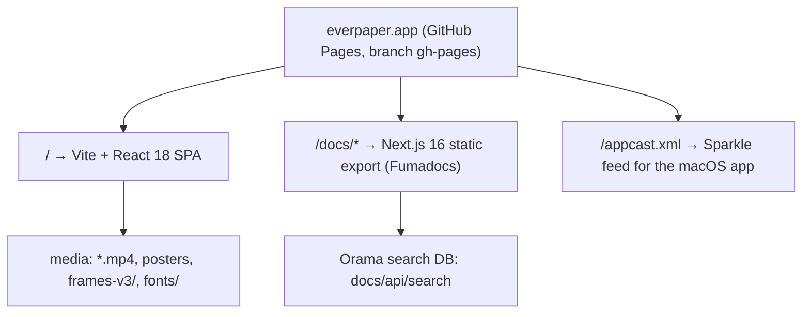

# Repository Guidelines

## Project Overview

This repository is the **published website for Everpaper**, a private, on-device daybook for macOS (day journal, meeting transcription, and a personal "second brain" — everything stays on the user's machine).

**This checkout is a deploy artifact, not a source tree.** It is the `gh-pages` branch of `github.com/iannellomarco/everpaper`, served by GitHub Pages at `https://everpaper.app` (apex domain via `CNAME`). `git ls-remote --heads origin` returns **only** `refs/heads/gh-pages` — there is no source branch here and no co-located source repo on disk.

Consequences an assistant must internalize:

- There is **no** `package.json`, `src/`, `tsconfig.json`, or `*.config.*` anywhere in the tree.
- There are **no** build, test, lint, or deploy commands (see [Development Commands](#development-commands)).
- `index.html`, `assets/**`, and `docs/**` are **generated output**. Content changes belong upstream in the (absent) source projects, then get re-exported into this branch.
- Only four files are genuinely hand-authored: `CNAME`, `.nojekyll`, `appcast.xml`, and `AGENTS.md`.

## Architecture & Data Flow

Two independently built front ends share one origin, plus a Sparkle release feed:



### Root marketing SPA (`/`)

- **Stack:** React `18.3.1` + Motion/Framer Motion `11.18.2`, compiled Tailwind, Vite production build. Version strings are recoverable from the bundle (`assets/index-B0rqYtEQ.js`); the Vite version is not.
- Single mount point: `index.html` renders `<div id="root">`; everything else is client-rendered, so page copy and nav links exist **only inside the minified bundle**, never in the HTML.
- **Section order as shipped:** header nav (`Home`, `The Problem`, `Philosophy`, `The App`) → hero ("A private memory for your Mac" / `COMING SOON`) → product film → Problem → Philosophy → App (five scroll panels: Daybook, Minutes, Second Brain, Concordance, Gate) → CTA ("Start remembering.") → footer.
- **No analytics, telemetry, or third-party scripts.** No Plausible/gtag/PostHog/Sentry/beacon. The only `fetch()` calls are Vite's module-preload polyfill and the same-origin hero video. Keep it that way unless explicitly asked.
- **No source maps** are shipped (`sourceMappingURL` absent from both assets).

**Hero scroll-scrub data flow** (the one non-obvious runtime behavior, in `assets/index-B0rqYtEQ.js`):

| Client condition | Path taken |
| --- | --- |
| Desktop / fine pointer | Fetch `/story-scrub-v3.mp4` as a blob (up to 2 attempts), map scroll progress → `video.currentTime` |
| Coarse pointer, iOS, or `?seq` query | Preload 72 `Image` objects and `canvas.drawImage(…, 0, 0, 960, 540)` the nearest loaded frame |
| `save-data` or 2G | Plain autoplaying loop |

Frame URLs are **built dynamically** — the literal builder is `` `/frames-v3/f${String(e+1).padStart(3,"0")}.jpg` `` with constants `72`, `960`, `540`. No per-frame path appears as a string literal, so never delete `frames-v3/` as "unreferenced". Reduced-motion preference is honored.

### Docs site (`/docs/*`)

- **Stack:** Next.js `16.2.7` App Router **static export** at basePath `/docs`, React/React DOM `19.3.0-canary-3f0b9e61-20260317`, Turbopack chunks, **Fumadocs UI** authored from MDX (Shiki bundled for code highlighting). Confirmed via `window.next={version:"16.2.7",appDir:!0}` in `docs/_next/static/chunks/1r7gd36us-7gm.js` and `fumadocs-ui/layouts/docs/*` error strings.
- Routing is a route group `(docs)` wrapping an optional-catch-all `[[...slug]]` (`param.type:"oc"` in `docs/__next._tree.txt`). Build ID `L6lgmg1cZ9xuX_OcNWGcU` names `docs/_next/static/L6lgmg1cZ9xuX_OcNWGcU/` and recurs throughout the RSC payloads.
- **Every route is a directory containing `index.html`** (trailing-slash export style).

**Each docs route is a coordinated set of nine artifacts**, not one file:

| Artifact | Role |
| --- | --- |
| `index.html` | First hard load (server-rendered markup) |
| `index.txt` / `__next._full.txt` | Byte-identical pair; the combined React Flight payload |
| `__next._tree.txt` | Route topology + build ID + `staleTime` |
| `__next._head.txt` | Head/metadata payload |
| `__next._index.txt` | Root layout + search shell (records `{type:"static"}`) |
| `__next.!KGRvY3Mp.txt` | The `(docs)` route-group layout and full sidebar tree |
| `__next.!KGRvY3Mp.$oc$slug.txt` | Catch-all slug segment shell |
| `__next.!KGRvY3Mp.$oc$slug.__PAGE__.txt` | Page body + table of contents |

`!KGRvY3Mp` is base64 `(docs)` (`echo -n KGRvY3Mp | base64 -d`); `!` marks an encoded route-group segment. **`index.txt` is not Markdown** — it is RSC/Flight serialization. Editing `index.html` alone leaves hydration, head metadata, TOC, sidebar, and search stale, and the old content reappears on client-side navigation.

**Docs IA / sidebar order:** Welcome → Getting started → Day Journal → Meetings → Second Brain → Recall → Calendar Auto-Start → Privacy → Command line → Export → Updates & Support → Release notes. HTML titles are `<Name> | Everpaper`.

**Search:** `docs/api/search` is an extensionless JSON **Orama** "advanced" serialized database (1,141,233 bytes, 723 indexed records), the Fumadocs static-search export. See [Known Issues](#known-issues) — it is currently unreachable at the URL the client requests.

### Release feed (`/appcast.xml`)

Sparkle RSS 2.0 feed (`xmlns:sparkle="http://www.andymatuschak.org/xml-namespaces/sparkle"`), channel `Everpaper Updates`. It is **intentionally empty** — zero `<item>` elements, with the comment `No public releases yet. Items are appended by the release pipeline at launch.` Do not treat the empty feed as missing data. A prior revision (`git show 6efd47e^:appcast.xml`) held 40 items and shows the required item shape:

```xml
<item>
  <title>…</title>
  <pubDate>…</pubDate>
  <sparkle:version>…</sparkle:version>              <!-- build number -->
  <sparkle:shortVersionString>…</sparkle:shortVersionString>
  <sparkle:minimumSystemVersion>…</sparkle:minimumSystemVersion>
  <enclosure url="…" sparkle:edSignature="…" length="…" type="application/octet-stream"/>
</item>
```

Note `sparkle:edSignature` is an **attribute of `<enclosure>`**, not a child element. Publishing an item with a wrong or missing signature breaks in-app updates for every installed client.

## Key Directories

| Path | Contents |
| --- | --- |
| `/` (12 tracked files) | SPA entry `index.html`, hand-authored `CNAME` / `.nojekyll` / `appcast.xml`, and root media |
| `assets/` (2) | Content-hashed SPA bundle: `index-B0rqYtEQ.js` (307,278 B), `index-DOw5bKPD.css` |
| `docs/` (151) | Next.js static export: per-route dirs, `_next/static/chunks/`, `api/search`, generated 404s |
| `frames-v3/` (72) | `f001.jpg`–`f072.jpg`, the canvas scrub fallback sequence |
| `fonts/` (5) | Self-hosted WOFF2 for the SPA only |

## Development Commands

**This repository has no build, test, lint, or deploy commands.** Verified absent: `.github/workflows/**`, `.gitlab-ci.yml`, `netlify.toml`, `vercel.json`, `Makefile`, `justfile`, any `*.sh`, and any package manifest. Do **not** run `npm`/`bun`/`pnpm install` — there is nothing to install, and do not invent script names.

What actually works here:

```bash
# Local preview — MUST be served from the repo root so the /docs basePath resolves.
python3 -m http.server 8099
# verified: / → 200, /docs/ → 200, /docs/cli/ → 200, /docs/api/search → 200

# Deploy = commit to gh-pages and push. GitHub Pages serves the branch directly.
git add -A && git commit -m "site: …" && git push origin gh-pages

# Production smoke check
curl -s -o /dev/null -w '%{http_code}\n' https://everpaper.app/docs/

# Frame-sequence integrity (expects 72 and no gaps)
ls frames-v3 | wc -l

# Media probes used to establish asset facts
ffprobe -v error -show_entries stream=width,height,codec_name -of csv=p=0 story-scrub-v3.mp4
sips -g pixelWidth -g pixelHeight og.png
```

Serving `docs/` as its own root will 404 every asset, because chunk URLs are root-absolute `/docs/_next/…`.

## Code Conventions & Common Patterns

**Commit messages** — `scope: lowercase evocative prose`. Observed scope counts across the 9-commit history: `site:` ×3, `pages:` ×3, `appcast:` ×1 (plus two legacy `Create CNAME` / `Delete CNAME`). Bodies are always empty. Em dashes are idiomatic. Pick the scope by layer:

```
site: the footer speaks for its maker — X handles and mail, the repo link retired
appcast: start the Everpaper feed clean — no public releases yet
pages: stand up the Everpaper update feed and parked page
```

**Asset naming**

- SPA bundles are content-hashed: `index-[8 chars].{js,css}`. If you ever change bundle bytes, the hash becomes a lie — rename **and** update the two references in `index.html:27-28` together, or accept stale caches.
- Frames: `f%03d.jpg`, **1-based**, gapless `001`–`072`, all `960×540` baseline JPEG. Adding, removing, or resizing frames breaks both the hardcoded count (`72`) and dimension constants (`960`, `540`) in the bundle, and parity with `story-scrub-v3.mp4`.
- Docs chunks: `/docs/_next/static/chunks/<content-hash>.js|css`. Never rename independently of the RSC payloads that reference them.

**URLs and links** — all asset paths are root-absolute (`/fonts/…`, `/frames-v3/…`). SPA section anchors are lowercase semantic IDs navigated by hash link: `home`, `problem`, `philosophy`, `features`, `get-started`. Authored outbound links are exactly `https://x.com/geteverpaper`, `https://x.com/marcoiannello`, `https://everpaper.app/docs/`, `https://everpaper.app/docs/privacy/`, `mailto:marco@everpaper.app`.

**Typography** — the SPA self-hosts five faces declared in `assets/index-DOw5bKPD.css`: Newsreader (200–800, normal + italic), iA Writer Quattro (400/700), iA Writer Mono (400). No declared font is missing and no shipped font is orphaned. The docs site deliberately uses **system** sans/mono stacks via `--font-sans`/`--font-mono` — it ships no font binaries and no `@font-face`. The iA Writer faces are licensing-sensitive; no license file is present in this repo.

**Theme tokens** (SPA CSS custom properties): `--background`, `--foreground`, `--accent`, `--hero-subtitle`, `--well`, `--edge`, `--radius`.

**Binary policy** — no `.gitattributes`, **no Git LFS**. Media is committed as ordinary Git objects: 3 MP4s (6,096,128 B), 75 JPGs (2,869,274 B), 7 PNGs (3,651,079 B), 5 WOFF2s (578,528 B). Tracked payload totals 18,293,534 B; `.git` is 12 MB. Every re-export that changes hashed filenames grows history permanently — replace binaries deliberately, not casually. There is **no `.gitignore`**, so nothing filters this directory: any stray file left here (a scratch script, a `.DS_Store`, a downloaded video) *will* be swept in by `git add -A`. Stage explicitly, or run `git status --porcelain --ignored` first. No `.DS_Store` is tracked today; keep it that way.

**Duplicated assets that must move together** (verified byte-identical by SHA-256):

- `og.png` ≡ `docs/og.png` — 2400×1260 (a 2× 1200×630 social card), 1,359,644 B each
- `app-icon.png` ≡ `docs/icon.png` — 512×512, 287,753 B each
- Also present: `docs/apple-icon.png` at 180×180

Updating one member of a pair silently makes root and docs branding diverge.

## Important Files

| File | Why it matters |
| --- | --- |
| `index.html` | SPA entry; `<head>` holds all SEO/OG metadata and the preload list (lines 5–28) |
| `assets/index-B0rqYtEQ.js` | The entire marketing page. Minified, single-line, ~300 KB, no source map — **not editable source** |
| `assets/index-DOw5bKPD.css` | Compiled Tailwind + `@font-face` + theme tokens, single line |
| `CNAME` | Exactly `everpaper.app`. Editing this changes the production domain |
| `.nojekyll` | Empty marker. **Deleting it makes Jekyll hide every `docs/_next/…` underscore path** and breaks the docs site |
| `appcast.xml` | Sparkle feed; the one file a release process appends to |
| `docs/__next._tree.txt` | Smallest readable proof of the docs route topology and build ID |
| `docs/api/search` | Prebuilt Orama search index (1.1 MB) |
| `docs/404.html`, `docs/404/index.html`, `docs/_not-found/index.html` | All byte-identical (11,210 B). See Known Issues |

Media: `story-scrub-v3.mp4` (960×540, 24.125 s, H.264, 24 fps, 3,596,819 B — both preloaded in `index.html:6` and fetched by the scrub runtime), `ink.mp4` (1920×1080, 8.04 s), `brag-play.mp4` (1280×720, 24 s, 30 fps). Posters: `story-poster.jpg` and `ink-poster.jpg` match their video dimensions exactly; `brag-poster.jpg` is 1920×1080 against a 1280×720 video — same aspect, 1.5× scale.

## Runtime/Tooling Preferences

- **Serving:** pure static. No runtime, no server, no environment variables, no secrets in this repo. Any static file server rooted at the repo root is sufficient.
- **Package manager:** none applies here. Do not add one, and do not add a manifest to a deploy branch.
- **Upstream toolchain** (implied by the artifacts, since the sources are absent): Vite + React 18 + Tailwind + Motion for the root SPA; Next.js 16 App Router + Turbopack + Fumadocs + MDX for `docs/`. Match these versions if you reconstruct or regenerate either app.
- **Deployment** is GitHub Pages serving the `gh-pages` branch at the `CNAME` apex. No Pages configuration file exists in the repo, so the Pages source is set in the GitHub UI. `[INFERENCE]` — inferred from branch name + `CNAME` + `.nojekyll`, confirmed only by the live site responding.
- **Preferred edit posture:** regenerate upstream and replace whole files. Hand-editing generated output is a last resort; if you must, change `index.html` metadata only, and never touch minified bundles or RSC payloads.

## Testing & QA

**There is no test framework, no test files, and no CI in this repository.** Nothing to run, and no coverage expectation — do not scaffold a suite into a deploy branch.

QA here is verification of the published artifact. Practical checks:

```bash
# 1. Nothing unintended is staged (no .gitignore exists to save you)
git status --porcelain --ignored

# 2. Frame sequence is intact: 72 files, gapless, uniform dimensions
ls frames-v3 | wc -l
sips -g pixelWidth -g pixelHeight frames-v3/f001.jpg frames-v3/f072.jpg

# 3. Duplicate asset pairs still agree
shasum -a 256 og.png docs/og.png app-icon.png docs/icon.png

# 4. Appcast is well-formed XML
xmllint --noout appcast.xml

# 5. Live route smoke test after push
for u in / /docs/ /docs/cli/ /docs/privacy/ /appcast.xml /docs/api/search; do
  printf '%-22s ' "$u"; curl -s -o /dev/null -w '%{http_code}\n' "https://everpaper.app$u"
done
```

Manual checks that no command covers: hero scroll-scrub on both a desktop pointer and a touch device (force the fallback with `?seq`), reduced-motion behavior, and docs client-side navigation between two routes.

## Known Issues

1. **Docs search is broken in production.** The Fumadocs static client fetches the root-absolute default `/api/search` — `"/api/search"` is the only such literal in `docs/_next/static/chunks/*.js`, with no `/docs/`-prefixed variant — but the index ships at `docs/api/search`. Verified live: `https://everpaper.app/api/search` → **404**, `https://everpaper.app/docs/api/search` → **200**. GitHub Pages has no rewrite layer, so the fix belongs upstream: set the Fumadocs search `from` to `/docs/api/search` and re-export.
2. **No site-wide custom 404.** GitHub Pages only auto-serves a **site-root** `404.html`, and the root has no such file (`https://everpaper.app/nonexistent-xyz` returns the Pages default). The three identical generated 404s under `docs/` are reachable only at their literal paths (`/docs/404.html`, `/docs/404/`, `/docs/_not-found/`); an unknown `/docs/...` URL does **not** get them. Fix by placing a `404.html` at the repo root.
3. **`iAWriterQuattroS-Bold.woff2` is declared in CSS but not preloaded**, while the other four faces are (`index.html:7-10`). Cosmetic; noted so the asymmetry is not mistaken for a missing file.
